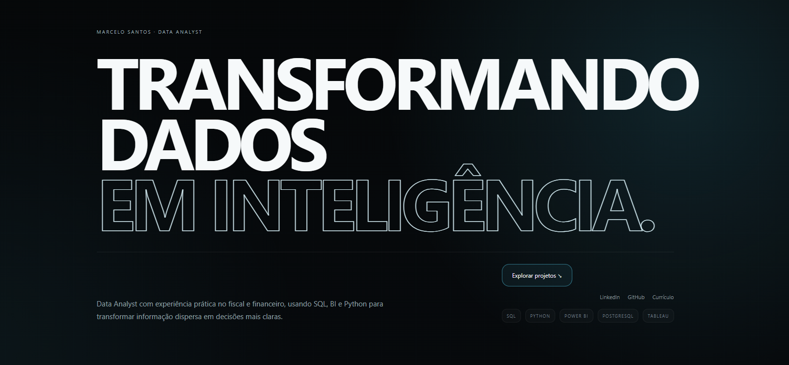
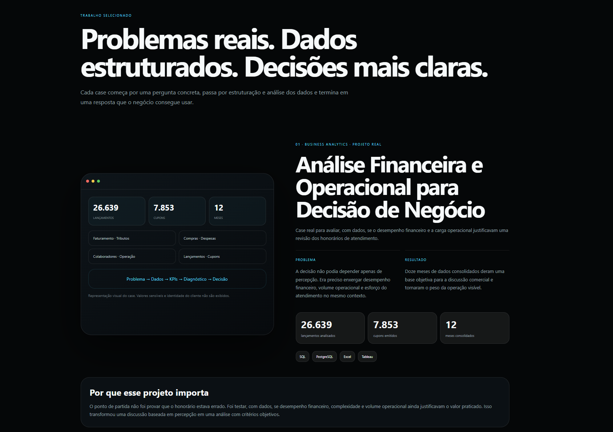
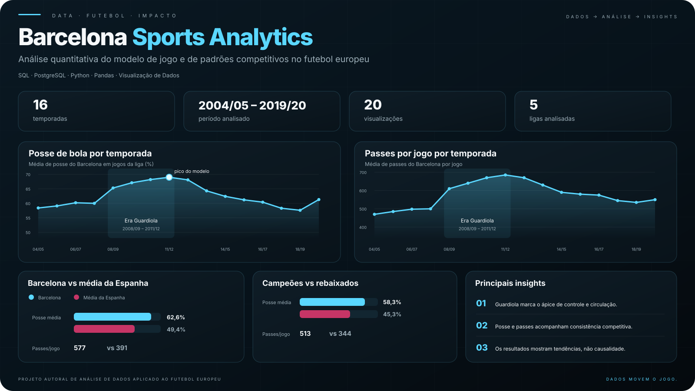

<div align="center">

# Marcelo Santos
### Data Analytics · Business Intelligence

Problemas reais. Dados estruturados. Decisões mais claras.

**[Explorar o portfólio ↗](https://marcelo-santos-data-marcelo123000-8683.vercel.app)** · [LinkedIn](https://www.linkedin.com/in/marcelo-augusto-santos88) · [Currículo em PDF](cv.pdf)

</div>

[](https://marcelo-santos-data-marcelo123000-8683.vercel.app)

## Sobre o portfólio

Sou Marcelo Santos e atuo na interface entre dados, processos e negócio, com experiência prática no setor fiscal e financeiro. Este portfólio reúne minha trajetória e projetos que mostram como transformo uma pergunta de negócio em uma análise: estruturar o problema, preparar os dados, investigar padrões e comunicar resultados que apoiem decisões.

**SQL · PostgreSQL · Python · Pandas · Excel · Power BI · Tableau**

## Projetos em destaque

### 01 — Análise Financeira e Operacional para Decisão de Negócio

**Business Analytics · Aplicação em um problema real**

O desempenho financeiro e a carga operacional de um cliente justificavam uma revisão dos honorários? A análise reuniu dados de faturamento, tributos, compras, despesas e operação para colocar essa decisão em uma base objetiva.

| Período consolidado | Lançamentos analisados | Cupons emitidos |
| :---: | :---: | :---: |
| **12 meses** | **26.639** | **7.853** |

- **Processo:** coleta, tratamento, padronização e validação das informações; consultas SQL, indicadores e dashboards.
- **Entrega:** diagnóstico do desempenho financeiro e do esforço operacional para apoiar a discussão sobre honorários.
- **Ferramentas:** SQL, PostgreSQL, Excel e Tableau.



O case é apresentado sem identificação do cliente ou valores financeiros sensíveis. As bases confidenciais não fazem parte deste repositório.

### 02 — Barcelona Sports Analytics

**Sports Analytics · Trabalho de Conclusão de Curso**

Investigação quantitativa sobre padrões de posse, passes e desempenho competitivo no futebol europeu, com foco no modelo de jogo do Barcelona entre **2004/05 e 2019/20**.

| Temporadas | Tabelas analíticas | Visualizações em Python |
| :---: | :---: | :---: |
| **16** | **18** | **20** |

- **Processo:** estruturação de hipóteses, limpeza e integração das bases, consultas SQL e validações de qualidade.
- **Entrega:** análise de tendências, comparação entre ligas e temporadas e documentação dos achados e das limitações do estudo, sem afirmar causalidade direta.
- **Ferramentas:** SQL, PostgreSQL, Python, Pandas, Matplotlib e Excel.



**[Consultar análise, código e documentação ↗](https://github.com/MRC888/barcelona-sports-analytics)**

## O site

Interface responsiva em tons escuros e ciano, com navegação por seções, alternância entre português e inglês e acesso aos projetos, à trajetória profissional e ao currículo.

| Camada | Implementação |
| --- | --- |
| Estrutura | HTML5 |
| Estilo | CSS com Grid, Flexbox e media queries |
| Interações | JavaScript sem frameworks |
| Publicação do site | Vercel |

As ferramentas de análise listadas nos cases pertencem aos respectivos projetos. Este repositório contém o site de apresentação.

### Estrutura

```text
├── index.html                     # Site, estilos e interações
├── cv.pdf                         # Currículo profissional atualizado
├── portfolio-home.png             # Capa do portfólio
├── case-financeiro.png            # Apresentação do case financeiro
├── barcelona-sports-analytics.png  # Apresentação do projeto esportivo
└── README.md
```

### Executar localmente

Clone o repositório e abra `index.html` no navegador. Não há dependências de build para instalar.

Opcionalmente, com Python instalado, execute na pasta do projeto:

```sh
python -m http.server 8000
```

Acesse `http://localhost:8000`. O gráfico do Barcelona exibido no site é carregado do repositório público do projeto e requer conexão à internet.

## Contato

Para oportunidades em **Análise de Dados e Business Intelligence**, entre em contato pelo [LinkedIn](https://www.linkedin.com/in/marcelo-augusto-santos88) ou pelo [e-mail profissional](mailto:marcelo123000@hotmail.com).

**[Visitar o portfólio completo ↗](https://marcelo-santos-data-marcelo123000-8683.vercel.app)**
