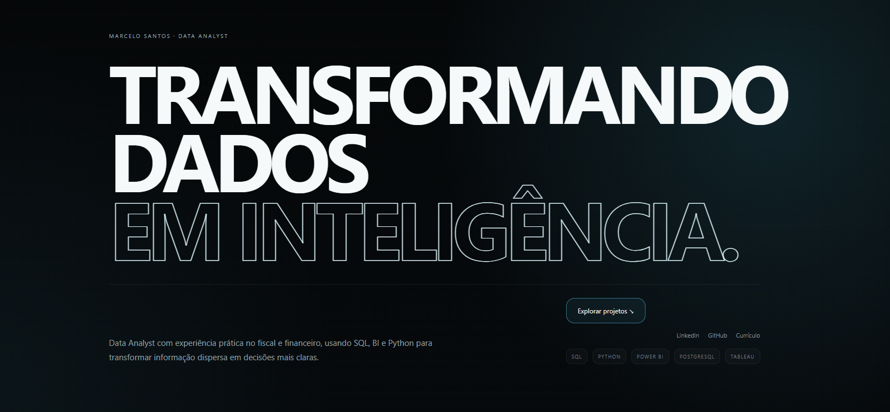
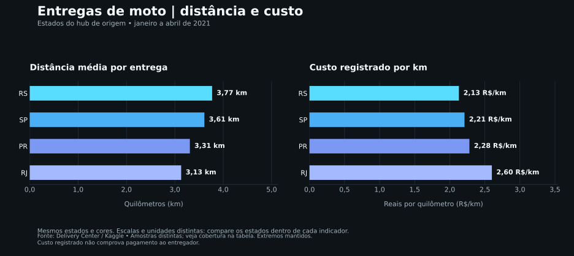
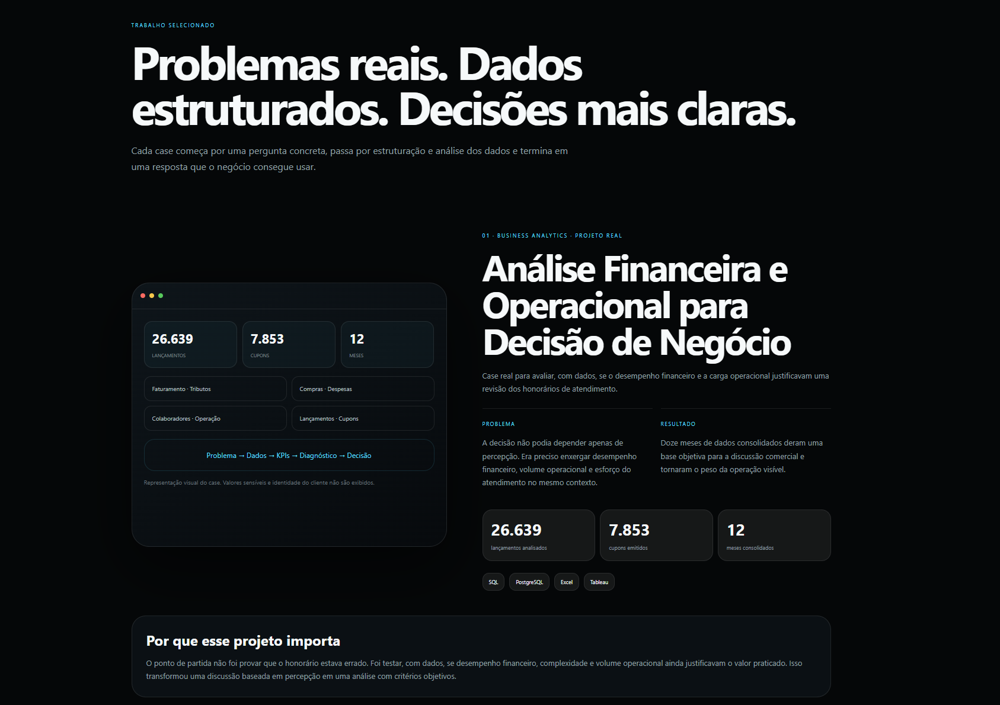
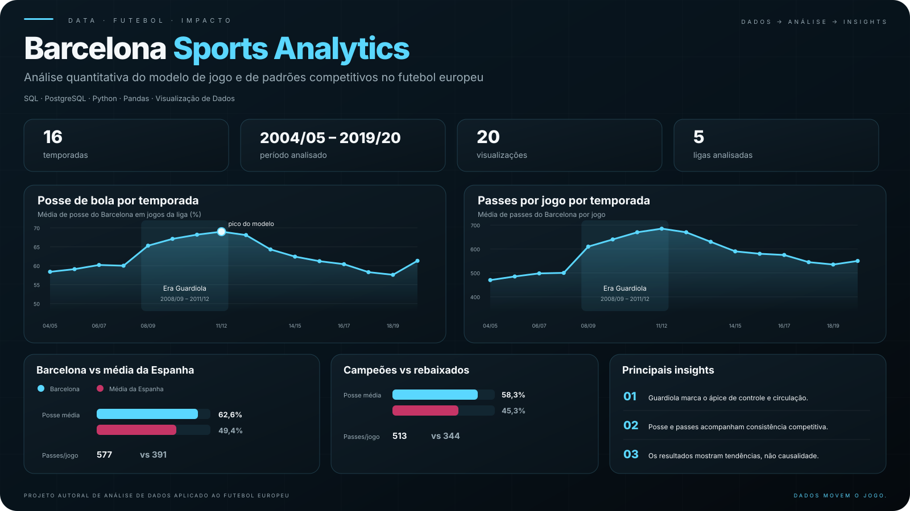
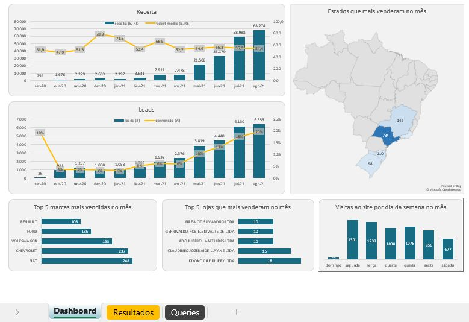
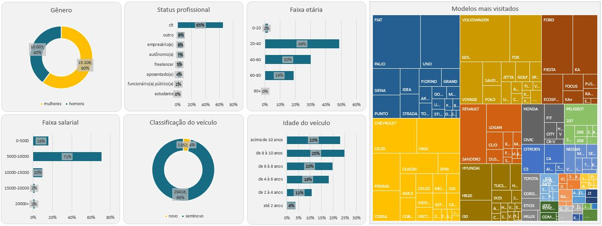

<div align="center">

# Marcelo Santos
### Data Analytics · Business Intelligence

Problemas reais. Dados estruturados. Decisões mais claras.

**[Explorar o portfólio ↗](https://marcelo-santos-data.vercel.app)** · [LinkedIn](https://www.linkedin.com/in/marcelo-augusto-santos88) · [Currículo em PDF](cv.pdf)

</div>

[](https://marcelo-santos-data.vercel.app)

## Sobre o portfólio

Sou Marcelo Santos e atuo na interface entre **dados, processos e negócio**, com experiência prática no setor fiscal e financeiro. Este portfólio reúne projetos que mostram como trabalho uma análise de ponta a ponta: entender o problema, preparar e validar os dados, investigar padrões e transformar resultados em informação útil para decisão.

**SQL · PostgreSQL · Python · Pandas · Excel · Power BI · Tableau**

## Projetos em destaque

### 01 — Foods & Goods

**Logistics Analytics · SQL + Python**

Projeto construído a partir de uma base pública do Delivery Center para explorar a operação, padronizar os dados e investigar uma pergunta de logística: **como a distância das entregas de moto varia entre os estados atendidos?**

| Pedidos concluídos | Período analisado | Análises iniciais |
| :---: | :---: | :---: |
| **352.020** | **120 dias** | **5** |

- **Processo:** exploração da base, validação de registros e IDs, padronização dos indicadores, junções em SQL e análise em Python.
- **Análise:** pedidos, GMV, ticket médio, variação mensal, distância média das entregas e custo registrado por km.
- **Ferramentas:** PostgreSQL, SQL, Python, Pandas e Matplotlib.



**[Ver projeto no GitHub ↗](https://github.com/MRC888/foods-and-goods)** · **[Explorar notebook ↗](https://github.com/MRC888/foods-and-goods/blob/main/01_logistica.ipynb)**

> A leitura é descritiva. O custo registrado na base não é tratado como remuneração do entregador, e a relação observada não é apresentada como evidência de causalidade.

---

### 02 — Análise de Honorário

**Business Analytics · Projeto real**

Case desenvolvido para avaliar, com dados, se o desempenho financeiro e a carga operacional de um cliente justificavam uma revisão dos honorários de atendimento.

| Período consolidado | Lançamentos analisados | Cupons emitidos |
| :---: | :---: | :---: |
| **12 meses** | **26.639** | **7.853** |

- **Processo:** consolidação, tratamento, padronização e validação das informações.
- **Análise:** faturamento, tributos, compras, despesas, lucro e carga operacional.
- **Entrega:** indicadores, consultas SQL e dashboards para transformar uma discussão subjetiva em uma decisão sustentada por evidências.
- **Ferramentas:** SQL, PostgreSQL, Excel e Tableau.



O case é apresentado sem identificação do cliente ou exposição de valores financeiros sensíveis. As bases confidenciais não fazem parte deste repositório.

---

### 03 — Barcelona Sports Analytics

**Sports Analytics · Trabalho de Conclusão de Curso**

Investigação quantitativa sobre padrões de posse, passes e desempenho competitivo no futebol europeu, com foco no modelo de jogo do Barcelona entre **2004/05 e 2019/20**.

| Temporadas | Tabelas analíticas | Visualizações |
| :---: | :---: | :---: |
| **16** | **18** | **20** |

- **Processo:** estruturação de hipóteses, limpeza e integração das bases, consultas SQL e validações de qualidade.
- **Análise:** tendências de posse, volume de passes e comparação entre campeões, rebaixados, ligas e temporadas.
- **Entrega:** documentação dos achados e limitações, tratando os resultados como associações exploratórias e não como prova de causalidade.
- **Ferramentas:** SQL, PostgreSQL, Python, Pandas, Matplotlib e Excel.



**[Consultar análise, código e documentação ↗](https://github.com/MRC888/barcelona-sports-analytics)**

---

### 04 — Projeto Prático Udemy

**Data Analytics · Projeto de treinamento**

Projeto desenvolvido durante uma formação em Data Analytics na Udemy, percorrendo preparação, análise e visualização de uma base comercial até a construção de dois dashboards complementares.

- **Dashboard 01 — Performance comercial:** receita, ticket médio, leads, conversão, estados, marcas, lojas e visitas por dia da semana.
- **Dashboard 02 — Perfil dos leads:** gênero, status profissional, faixa etária e salarial, classificação e idade dos veículos e modelos mais visitados.
- **Foco:** prática de análise, construção de indicadores e comunicação visual dos resultados.

<table>
  <tr>
    <td width="50%" align="center">
      
    </td>
    <td width="50%" align="center">
      
    </td>
  </tr>
</table>

> Projeto guiado, desenvolvido a partir do conteúdo e da base fornecidos no curso. Ele é apresentado como evidência de prática e aprendizado, não como projeto autoral.

## Projetos complementares

Além dos cases de dados, o portfólio também reúne projetos que mostram programação, desenvolvimento e raciocínio de sistemas:

- **Aurora Seeker — FIAP:** sistema em Python para análise de telemetria, integridade operacional, autonomia energética, decisão de decolagem e simulação de missão. **[GitHub ↗](https://github.com/MRC888/Aurora-PBL-FIAP)**
- **MyCityHub:** projeto web criado para apresentar São Bento do Sapucaí por meio de calendário, natureza, cultura e gastronomia. **[GitHub ↗](https://github.com/MRC888/MyCityHub1)**

## O site

Interface responsiva em tons escuros e ciano, com navegação por seções, alternância entre português e inglês, animações de entrada e acesso aos projetos, trajetória profissional, competências, formação e contato.

| Camada | Implementação |
| --- | --- |
| Estrutura | HTML5 |
| Estilo | CSS com Grid, Flexbox e media queries |
| Interações | JavaScript sem frameworks |
| Publicação | Vercel |

As ferramentas de análise listadas nos cases pertencem aos respectivos projetos. Este repositório contém o site de apresentação e os assets usados no portfólio.

### Estrutura principal

```text
├── index.html
├── cv.pdf
├── portfolio-home.png
├── case-financeiro.png
├── barcelona-dashboard.svg
├── foods-and-goods.svg
├── foods-and-goods-mobile.svg
├── foods-panorama/
├── udemy-performance.png
├── udemy-perfil-leads.png
└── README.md
```

### Executar localmente

Clone o repositório e abra `index.html` no navegador. Não há dependências de build para instalar.

Opcionalmente, com Python instalado:

```sh
python -m http.server 8000
```

Acesse `http://localhost:8000`.

## Contato

Para oportunidades em **Análise de Dados e Business Intelligence**, entre em contato pelo [LinkedIn](https://www.linkedin.com/in/marcelo-augusto-santos88) ou pelo [e-mail profissional](mailto:marcelo123000@hotmail.com).

**[Visitar o portfólio completo ↗](https://marcelo-santos-data.vercel.app)**
